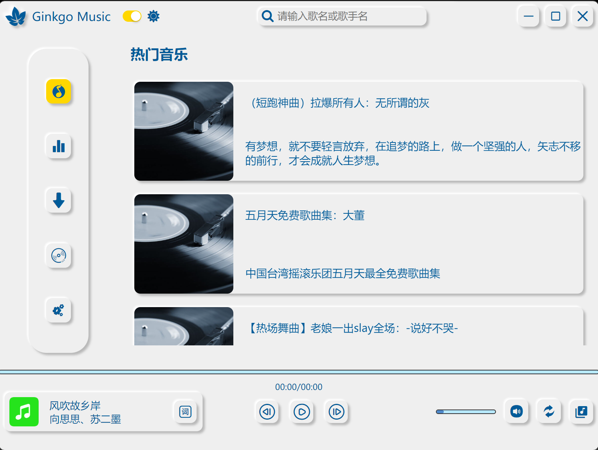
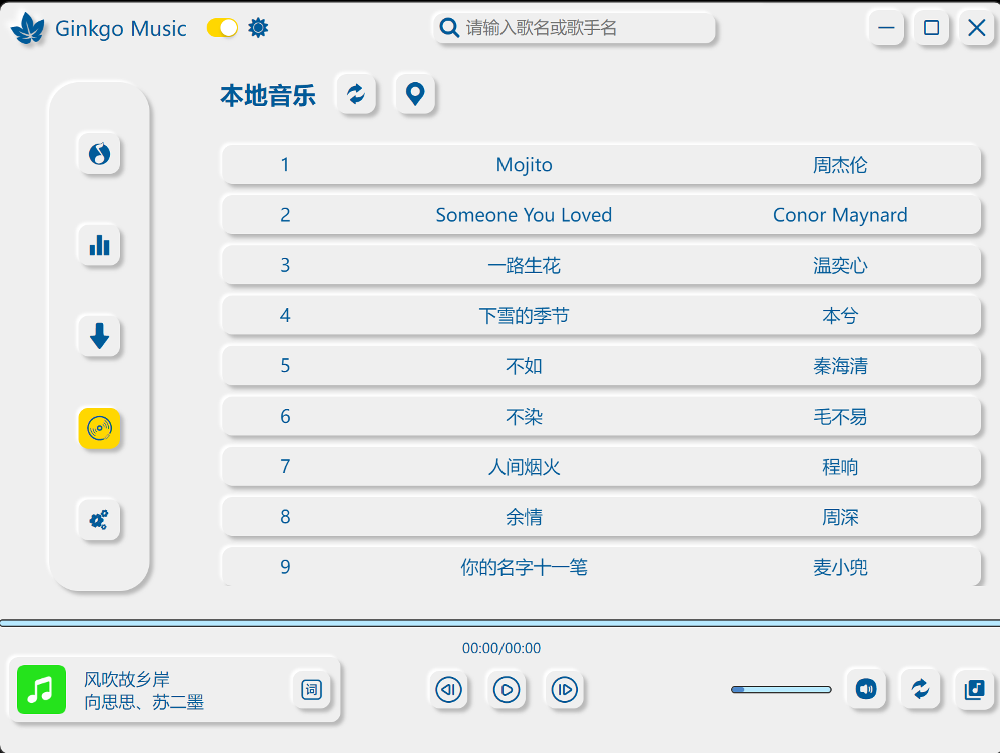
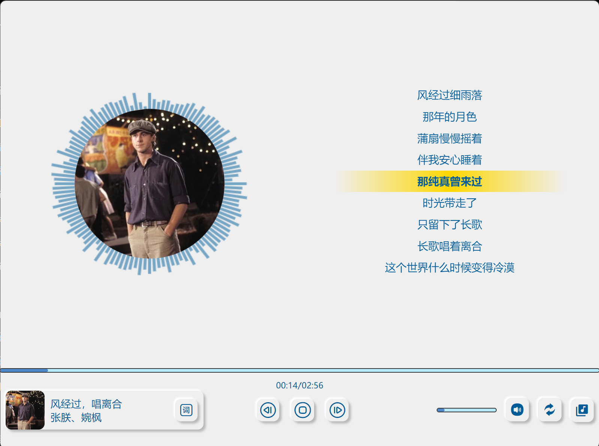
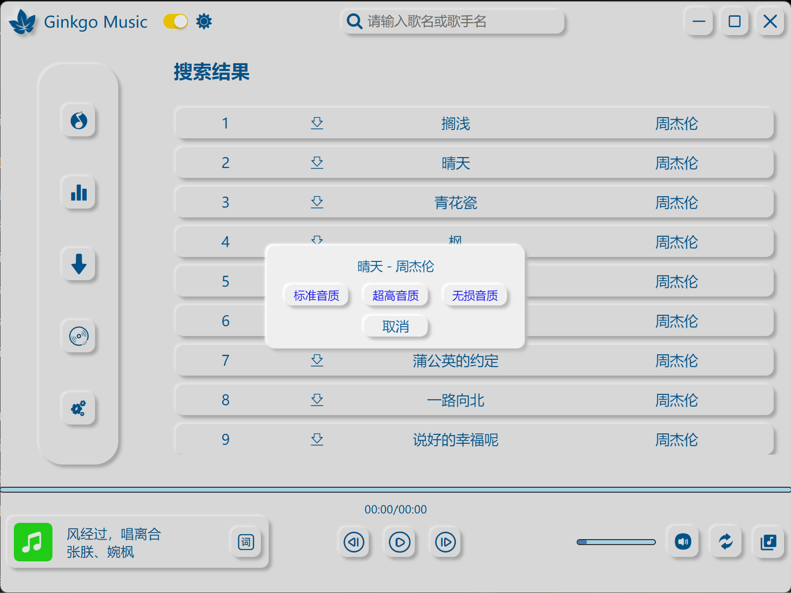

## Ginkgo Music 音乐播放器
>采用<b>`Electron`</b>框架构建 

## 编写语言
* <b>`JavaScript`</b> 
* <b>`CSS3`</b> 
* <b>`HTML5`</b> 
  
## 技术栈
* <b>`node:fs`：</b>文件系统，实现文件的增删改查 
* <b>`node:path`：</b>实现文件定位 
* <b>`XMLHttpRequest`：</b>网络请求 
* <b>`module`：</b>ES6模块化以及CommonJS模块化，避免全局污染 
* <b>`Web Audio API`：</b>实现音频可视化效果，及音乐律动效果 
* <b>`localStorage`：</b>实现数据暂存 

## 项目效果图
* 主页展示：
 
* 列表页面展示：
 
* 歌词律动页展示：
 
* 下载页面展示：
 

## 运行环境
* **`node@20.15.0`** 
* **`npm@10.7.0`** 

## 运行使用
><b>在项目跟目录打开终端运行以下命令</b>
* <b>安装依赖：`npm install`</b> 
* <b>项目运行：`npm start`</b> 
* <b>项目打包：`npm run build`</b> 
